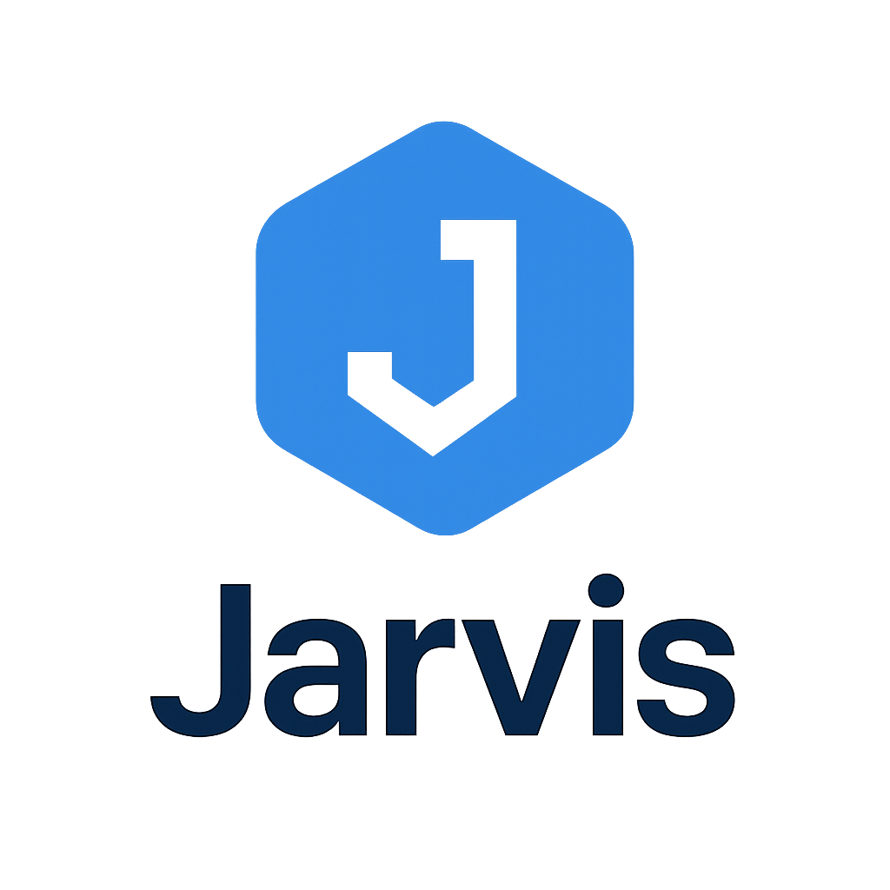

# RAGAgent

Creating a simple agent that performs RAG.


<table align="center">
  <tr>
    <td align="center">
      
    </td>
  </tr>
</table>

<h1 align="center">Jarvis 🧠⚡</h1>


<p align="center">

&nbsp; A retrieval agent built with <a href="https://www.langchain.com/langgraph">LangGraph</a> and managed with <a href="https://github.com/astral-sh/uv">uv</a>.

</p>


---


## ✨ Features


- 🔍 **Retrieval-Augmented Generation (RAG)** powered by LangGraph  

- 📦 **Dependency management** using uv  

- ⚡ **Lightweight & performant** agent execution  

- 🔗 **Composable graph-based workflows**  

- 🧩 Easy integration with external tools and APIs  


---


## 🚀 Getting Started


### Prerequisites

- Python 3.12+

- [uv](https://github.com/astral-sh/uv) installed


### Installation


Clone the repository:


```bash

git clone https://github.com/ArlindKadra/RAGAgent.git

cd RAGAgent

# Install dependencies
uv sync
```